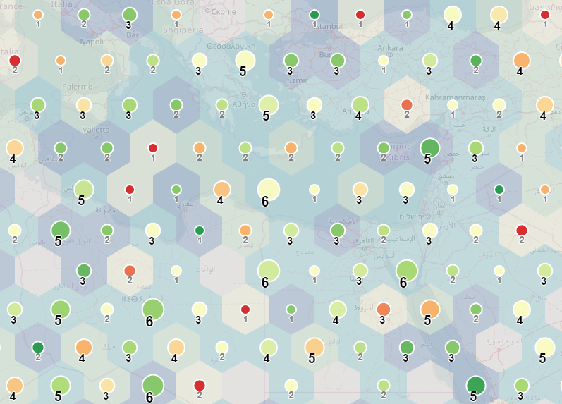

# (experimental) Regular-grid-cluster plugin/library for Leaflet



## demo
- [random data example](https://adammertel.github.io/Leaflet.RegularGridCluster/demo/random_data )
- [two datasets example](https://adammertel.github.io/Leaflet.RegularGridCluster/demo/two_datasets )


## motivation
the basic idea of this library is to present the custom method to both **visualise and cluster** larger dataset (or to be able to visually compare correlation between two different datasets). This method is based on the idea of distributing the dataset(elements) into **regular shaped zones**. Plugin can work with **point data** in the form of L.Marker or L.Circle/L.CircleMarker. This concept is suitable to visualise **multivariate datasets**. 
Grid consists of 3 different component classes, each could styled separately or optionally turned on and off:
- **cells** - regularly shaped polygon (squares and hexagons are implemented) (graphical variables - fill/stroke color, fill/stoke opacity, ...)
- **markers** - circle-shaped marker centered to cell (graphical variables - radius, fill/stroke colorm fill/stoke opacity, ...)
- **texts** - text inside the cell that holds selected information about clustered data (graphical variables - font, font size, color,...)


## options
 - **gridMode** (*default: 'square'*) 'square' of 'hexagon' values. The shape of cells
 - **zoneSize** (*default: 10000*) size of the cell at a scale of 10
 - **gridOrigin** (*default: 'auto'*) setting the value of a L.latLng instance will manually define the SW corner of the grid. Value 'auto' will define the origin based on data and gridBoundsPadding, 
 - **gridBoundsPadding** (*default: 0.1*) ratio to extend bounding box of elements 
 
 - **showCells** (*default: true*) turning cells off and on
 - **showMarkers** (*default: true*) turning markers off and on
 - **showTexts** (*default: true*) turning texts off and on
 - **showEmptyCells** (*default: false*) whether display cells where no elements fall
 - **emptyCellOptions** styling of empty cells
 
 
 - **zoomShowElements** (*default: 10*) level of zoom when to turn elements on and off
 - **zoomHideGrid** (*default: 10*) level of zoom when to turn grid on and off
 
 - **indexSize** (*default: 12*) for a better performence, zones and elements are pre-indexed. Option indexSize difenes the number of super-zones within each axis
 - **rules** (*default rules: {cells: {}, markers: {}, texts: {} }*) values to define how components will look like. Every rule can be defined as dynamic or static (see section **rules** or [random data example](https://adammertel.github.io/Leaflet.RegularGridCluster/demo/random_data ))

 - **paneElementsZ** (*default: 10000*) 
 - **paneCellsZ** (*default: 700*) 
 - **paneMarkersZ** (*default: 800*) 
 - **paneTextsZ** (*default: 900*) 


## rules
Rules object consists of 3 key-values pairs - **cells, **markers** and **texts**. Most of the naming is technicaly the same as in the L.Path class (see [leaflet documentation](http://leafletjs.com/reference-1.0.3.html#path)). Differences are mainly within texts (*fontSize*, *fontWeight*). 
To create a dynamical rule, one has to define a **method**, **scale**, **style**, **domain** and **attribute** parameters:
 - **method** ('count', 'mean', 'median', 'mode', 'min', 'max' and 'sum') - operation how the result value will be calculated from the overlapping elements
 - **scale** ('size' - equal size, 'quantile', 'continuous') - how threshold values will be defined for  intervals. 'Continous' value will create a continuous scale
 - **range** - array with values to set how to style the variable
 - **domain** - array of two values to define minimum (first value) and maximum (second value) of input manually. If this is not defined, maximum and minimum will be set based on the data.
 - **attribute** - name of the property that defines the rule (could be ommited in case, the method is 'count')

To test how these parameters work, please have a look at the [random data example](https://adammertel.github.io/Leaflet.RegularGridCluster/demo/random_data)


## how to
1. Create/Access some point data

```
    const maxX = 50, minX = 0, maxY = 49.5, minY = 0;
    const randomData = [];

    for (i=0; i < 1000; i++) {
        const coordinates = [
            minX + Math.random() * (maxX - minX),
            minY + Math.random() * (maxY - minY)
        ];
        const properties = {
            a: 5 + Math.floor(Math.random() * 5),
            b: Math.floor(Math.random() * 5)
        };

        const marker = L.circleMarker(coordinates, {radius: 1, fillColor: 'black'});
        randomData.push( {
            marker: marker, 
            properties: properties
        });
    };
```


2. Define the ruleset
```
    const rules = {
        cells: {
            "fillColor": {
                "method": "mean",
                "attribute": "b",
                "scale": "size",
                "range": ["#d7191c","#fdae61","#ffffbf","#a6d96a","#1a9641"]
            },
            "color": "black",
            "fillOpacity": 0.2,
            "weight": 0
        },
        markers: {
            "color": "white",
            "weight": 2,
            "fillOpacity": 0.9,
            "fillColor": {
                "method": "mean",
                "attribute": "b",
                "scale": "continuous",
                "range": ["#ffffb2","#fecc5c","#fd8d3c","#e31a1c"]
            },
            "radius": {
                "method": "count",
                "attribute": "",
                "scale": "continuous",
                "range": [7, 17]
            }
        },
        texts: {}
    }
```

3. create a new instance of L.RegularGridCluster and set the options and ruleset
```
    const grid = L.regularGridCluster(
        {
            rules: rules,
            gridMode: 'hexagon,
            showCells: true,
            showMarkers: true,
            showTexts: false
        }
    );
```

4. add data to the L.regularGridCluster instance
```
    grid.addLayers(pointData);
```


